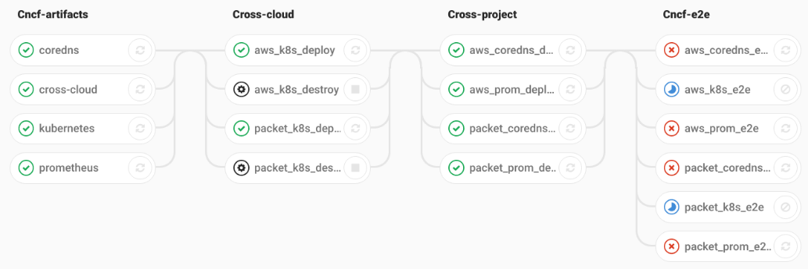

# cross-cloud
Cross Cloud Continuous Integration


#### What is cross-cloud?

This cross-cloud project aims to demonstrate cross-project compatibility in the
CNCF by building, E2E testing and deploying selected CNCF projects to multiple
clouds using continuous integration (CI). The initial proof of concept is being
done by deploying a Kubernetes cluster with CoreDNS and Prometheus to AWS and
Packet. The eventual goal is to support all CNCF projects on AWS, Packet, GCE,
GKE, Bluemix and Azure.

Our cross-cloud provisioning is accomplished with the terraform modules for
[AWS](./aws), [Azure](./azure), [GCE](./gce), [GKE](./gke), [Packet](./packet)
which deploy kubernetes using a common set of variables producing KUBECONFIGs
for each.



# How to Use Cross-Cloud TL;DR
Minimum required Configuration to use Cross-Cloud to Deploy a Kubernetes Cluster on Cloud X.
```bash
docker run \
  -v /tmp/data:/cncf/data \
  -e NAME=cross-cloud
  -e CLOUD=aws    \
  -e COMMAND=deploy \
  -e BACKEND=file  \ 
  -e AWS_ACCESS_KEY_ID=secret \
  -e AWS_SECRET_ACCESS_KEY=secret \
  -e AWS_DEFAULT_REGION=ap-southeast-2 \
  -e PACKET_AUTH_TOKEN=secret \
  -e TF_VAR_packet_project_id=secret \ 
  -e DNSIMPLE_TOKEN=secret \
  -e DNSIMPLE_ACCOUNT=secret \ 
  -e GOOGLE_CREDENTIALS=secret \
  -e GOOGLE_REGION=us-central1 \ 
  -e GOOGLE_PROJECT=test-163823 \
  -ti registry.cncf.ci/cncf/cross-cloud/provisioning:ci-stable-v0-1-0
```

Supported Values for 
* CLOUD=aws/gke/gce/packet 
* BACKEND=file/s3 (File will store the Terraform State file to Disk / S3 will store the Terraform Statefile to a AWS s3 Bucket)
* COMMAND=deploy/destroy


Custom Configuration options for the Kubernetes Cluster
* -e TF_VAR_pod_cidr=10.2.0.0/16      # Set the Kubernetes Cluster POD CIDR
* -e TF_VAR_service_cidr=10.0.0.0/24  # Set the Kubernetes Cluster SERVICE CIDR
* -e TF_VAR_worker_node_count=3       # Set the Number of Worker nodes to be Deployed in the Cluster
* -e TF_VAR_master_node_count=3       # Set the Number of Master nodes to be Deployed in the Cluster
* -e TF_VAR_dns_service_ip=10.0.0.10  # Set the Kubernetes DNS Service IP
* -e TF_VAR_k8s_service_ip=10.0.0.1   # Set the Kubernetes Service IP


#### How does it work?

We fork CNCF projects into the CNCF.ci gitlab server (https://gitlab.cncf.ci/)
where we add a .gitlab-ci.yml config file to drive the CI process.

Each push to projects branches we are interested in will generate binaries,
tests, and container images exported as ci variables that will allow continous
deployment of that projects artifacts.

Feedback on our approach to building and e2e testing welcome:

 * https://github.com/ii/kubernetes/pull/1 => https://gitlab.cncf.ci/kubernetes/kubernetes/blob/ci-master/.gitlab-ci.yml
 * https://github.com/ii/coredns/pull/1 => https://gitlab.cncf.ci/coredns/coredns/blob/ci-master/.gitlab-ci.yml
 * https://github.com/ii/prometheus/pull/1 https://gitlab.cncf.ci/prometheus/prometheus/blob/ci-master/.gitlab-ci.yml
 * https://github.com/ii/alertmanager/pull/1 => https://gitlab.cncf.ci/prometheus/alertmanager/blob/ci-master/.gitlab-ci.yml
 * https://github.com/ii/node_exporter/pull/1 => https://gitlab.cncf.ci/prometheus/node_exporter/blob/ci-master/.gitlab-ci.yml

## Cross-Cloud CI Pipeline Stages

### CNCF Artifacts 

In our first stage we tie together a particular set of project branches
(stable,master,alpha) and collect the release.env

We override these variables for the sets of branches we want to test together:

```yaml
variables:
  K8S_BRANCH: ci-master
  COREDNS_BRANCH: ci-master
  PROMETHEUS_BRANCH: ci-master
  NODE_EXPORTER_BRANCH: ci-master
  ALERT_MANAGER_BRANCH: ci-master
```


```
ALERT_MANAGER_IMAGE=registry.cncf.ci/prometheus/alertmanager
ALERT_MANAGER_TAG=ci-v0.6.2.e9aefe84.5699
COREDNS_IMAGE=registry.cncf.ci/coredns/coredns
COREDNS_TAG=ci-v007.97c730ab.5713
KUBERNETES_IMAGE=registry.cncf.ci/kubernetes/kubernetes/hyperkube-amd64
KUBERNETES_TAG=ci-v1-6-3.job.5949
NODE_EXPORTER_IMAGE=registry.cncf.ci/prometheus/node_exporter
NODE_EXPORTER_TAG=ci-v0.14.0.ae1e00a5.5696
PROMETHEUS_IMAGE=registry.cncf.ci/prometheus/prometheus
PROMETHEUS_TAG=ci-v1.6.3.fd07e315.6097
```

### Cross Cloud

The Cross cloud repo itself includes a [container](Dockerfile) which is used to
deploy k8s on several clouds, making the KUBECONFIG available for cross-project
deployments.


### Cross Project

We are currently using helm and overriding the image_url and image_tag with our
CI generated artifacts. and then runs runs E2E tests on the whole infrastructure


### CNCF e2e

Initially we are testing head and the last stable release of Kubernetes, CoreDNS
and Prometheus.


