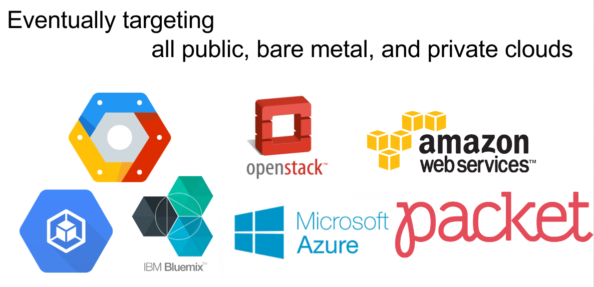
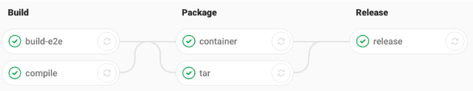
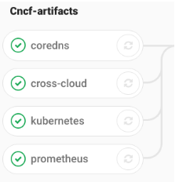
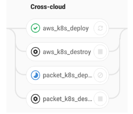
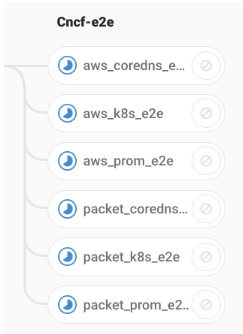
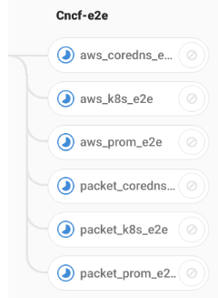

# cross-cloud
Cross Cloud Continuous Integration

#### What is cross-cloud?

This cross-cloud project aims to demonstrate cross-project compatibility in the
CNCF by building, E2E testing and deploying selected CNCF projects to multiple
clouds using continuous integration (CI). The initial proof of concept is being
done by deploying a Kubernetes cluster with CoreDNS and Prometheus to AWS and
Packet. The eventual goal is to support all CNCF projects on AWS, Packet, GCE,
GKE, Bluemix and Azure.

Our cross-cloud provisioning is accomplished with the terraform modules for
[AWS](./aws), [Azure](./azure), [GCE](./gce), [GKE](./gke), [Packet](./packet)
which deploy kubernetes using a common set of variables producing KUBECONFIGs
for each.

Each project is deployed and tested on each of the clouds. For now the results
will be available as we run each cross-cloud CI job, but plan to run them daily
and eventually per commit.

Our first public demo of cross-cloud pipeline was recorded during [June 27th CNCF CI WG Meeting](https://www.youtube.com/watch?v=Jc5EJVK7ZZk&feature=youtu.be&t=310)

<iframe width="560" height="315" src="https://www.youtube.com/embed/Jc5EJVK7ZZk&t=310?ecver=1" frameborder="0" allowfullscreen></iframe>



#### How does it work?

We fork CNCF projects into the CNCF.ci gitlab server (https://gitlab.cncf.ci/)
where we add a .gitlab-ci.yml config file to drive the CI process.

Each push to projects branches we are interested in will generate binaries,
tests, and container images exported as ci variables that will allow continous
deployment of that projects artifacts.

We frequent #cncf-ci on [slack.cncf.io](slack.cncf.io) and CNCF [wg-ci](https://github.com/cncf/wg-ci) [mailinglist](https://lists.cncf.io/mailman/listinfo/cncf-ci-public). 

### CNCF Project Pipelines



The CI yaml for each project builds artifacts needed to deploy and e2e test and
makes them available as environment variables.

```
ALERT_MANAGER_IMAGE=registry.cncf.ci/prometheus/alertmanager
ALERT_MANAGER_TAG=ci-v0.6.2.e9aefe84.5699
COREDNS_IMAGE=registry.cncf.ci/coredns/coredns
COREDNS_TAG=ci-v007.97c730ab.5713
KUBERNETES_IMAGE=registry.cncf.ci/kubernetes/kubernetes/hyperkube-amd64
KUBERNETES_TAG=ci-v1-6-3.job.5949
NODE_EXPORTER_IMAGE=registry.cncf.ci/prometheus/node_exporter
NODE_EXPORTER_TAG=ci-v0.14.0.ae1e00a5.5696
PROMETHEUS_IMAGE=registry.cncf.ci/prometheus/prometheus
PROMETHEUS_TAG=ci-v1.6.3.fd07e315.6097
```

# Cross-Cloud CI Pipeline Stages

### CNCF Artifacts 

In our first stage we tie together a particular set of project branches
(stable,master,alpha) and collect the release.env

We override these variables for the sets of branches we want to test together:

```yaml
variables:
  K8S_BRANCH: ci-master
  COREDNS_BRANCH: ci-master
  PROMETHEUS_BRANCH: ci-master
  NODE_EXPORTER_BRANCH: ci-master
  ALERT_MANAGER_BRANCH: ci-master
```


### Cross Cloud

The Cross cloud repo itself includes a [container](Dockerfile) which is used to
deploy k8s on several clouds, making the KUBECONFIG available for cross-project
deployments. We are looking to standardize on kubeadmin in the near future
across all our clouds.



### Cross Project

We are currently using helm and overriding the image_url and image_tag with our
CI generated artifact.

```
$ /cncf/provision.sh aws-deploy aws-ci-stable
Kubernetes master is running at
https://kz8s-apiserver-aws-mvci-stable-8857.ap-southeast-2.elb.amazonaws.com

$ /cncf/provision.sh aws-deploy packet-ci-stable
Kubernetes master is running at
https://endpoint.packet-mvci-stable.cncf.ci
```



### CNCF e2e

Initially we are e2e testing head and the last stable release of Kubernetes, CoreDNS
and Prometheus.

```
helm install --name coredns --set image.repository=${COREDNS_IMAGE} --set image.tag=${COREDNS_TAG} … stable/coredns

helm install --name prometheus --set server.image.repository=$PROMETHEUS_IMAGE --set server.image.tag=$PROMETHEUS_TAG --set nodeExporter.image.repository=$NODE_EXPORTER_IMAGE --set … stable/prometheus
```



Feedback on our approach to building and e2e testing welcome:

 * https://github.com/ii/kubernetes/pull/1 => https://gitlab.cncf.ci/kubernetes/kubernetes/blob/ci-master/.gitlab-ci.yml
 * https://github.com/ii/coredns/pull/1 => https://gitlab.cncf.ci/coredns/coredns/blob/ci-master/.gitlab-ci.yml
 * https://github.com/ii/prometheus/pull/1 https://gitlab.cncf.ci/prometheus/prometheus/blob/ci-master/.gitlab-ci.yml
 * https://github.com/ii/alertmanager/pull/1 => https://gitlab.cncf.ci/prometheus/alertmanager/blob/ci-master/.gitlab-ci.yml
 * https://github.com/ii/node_exporter/pull/1 => https://gitlab.cncf.ci/prometheus/node_exporter/blob/ci-master/.gitlab-ci.yml

